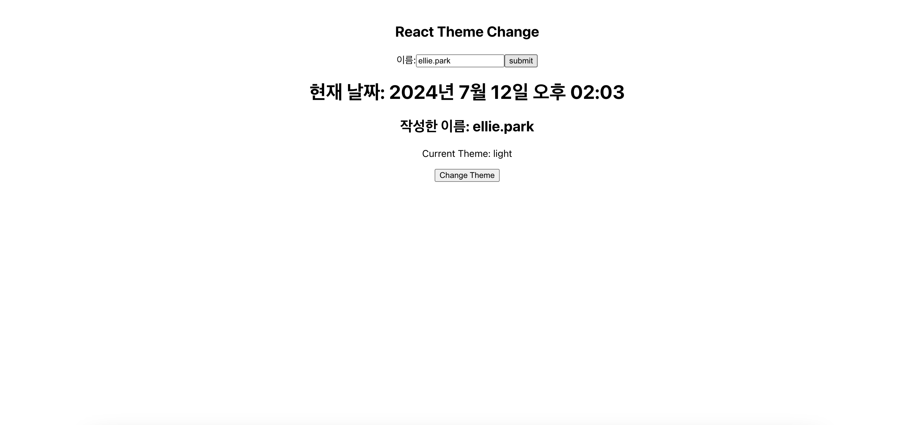
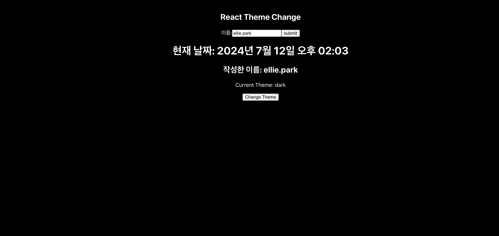

# Todo_Application

사용자가 입력한 이름과 현재 날짜를 표시하는 간단한 페이지입니다.
페이지 테마를 변경할 수 있습니다.

## 파일 구조
```bash
project-root/
├── src/
│ ├── Page/
│ │ ├── Mainpage.jsx
│ │ ├── ThemeContext.jsx
│ │ └── ThemedComponent.jsx
│ ├── App.js
│ └── index.js
├── package.json
└── README.md
```

- **src/**: 주요 소스 코드 디렉토리입니다.
  - **Page/**: 페이지 관련 컴포넌트들이 포함된 디렉토리입니다.
    - **Mainpage.jsx**: 메인 페이지 컴포넌트입니다.
    - **ThemeContext.jsx**: 테마 컨텍스트를 정의한 파일입니다.
    - **ThemedComponent.jsx**: 테마를 적용한 컴포넌트입니다.
  - **App.js**: 애플리케이션의 루트 컴포넌트입니다.
  - **index.js**: 애플리케이션의 진입점 파일입니다.
- **package.json**: 프로젝트 메타데이터와 종속성 관리 파일입니다.
- **README.md**: 프로젝트에 대한 설명 파일입니다.


## 예시 (Screenshot)




## 기능
1. 입력창에 이름을 입력하면 하단에 입력한 이름이 표시됩니다.
2. 현재 날짜와 시간이 표시됩니다.
3. change theme을 클릭하면 테마가 바뀝니다.
4. 테마는 'light', 'dark' 두 가지가 있습니다.

## 설치 (Installation)
```bash
git clone https://github.com/PARK-SSOYEON/Todo_Aplication_React.git
cd repo
npm install
npm install styled-components
```
